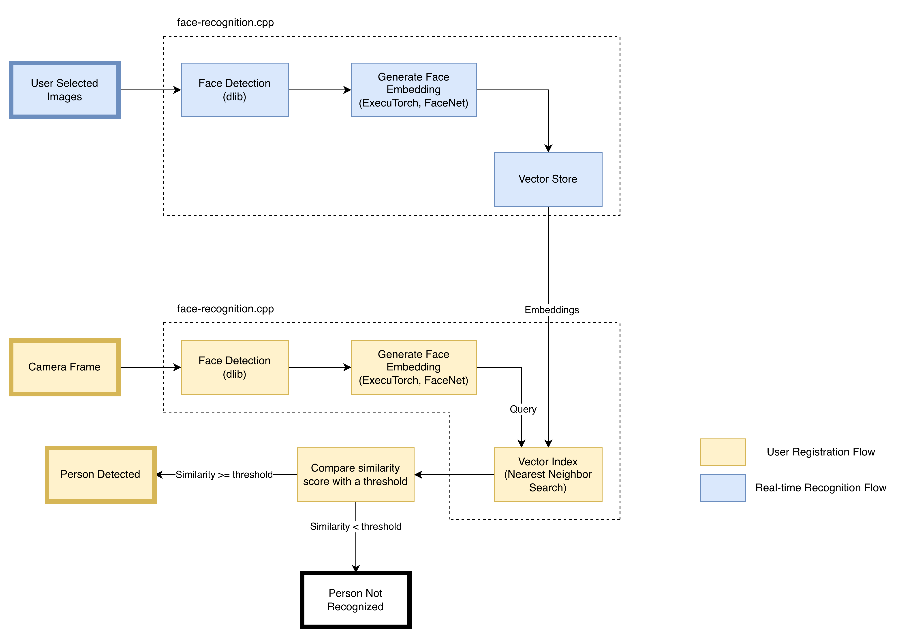

# On-Device Face Recognition In Android

> A simple Android app that performs on-device face recognition by comparing FaceNet embeddings
> against a vector database of user-given faces


> Download the APK from
> the [Releases](https://github.com/shubham0204/OnDevice-Face-Recognition-Android/releases)

## Updates

| Date        | Description                                                                                                                                           |
|:------------|:------------------------------------------------------------------------------------------------------------------------------------------------------|
| **2026-08** | Integrate [face-recognition.cpp](https://github.com/shubham0204/face-recognition.cpp), reducing app size and face recognition latency                 |
| **2025-12** | Add new FaceNet models with known sources, enable MLKit for face detection and precise NN-search                                                      |
| **2024-09** | Add face-spoof detection which uses FASNet from [minivision-ai/Silent-Face-Anti-Spoofing](https://github.com/minivision-ai/Silent-Face-Anti-Spoofing) |
| **2024-07** | Add latency metrics on the main screen. It shows the time taken (in milliseconds) to perform face detection, face embedding and vector search.        |

## Goals

* Produce on-device face embeddings with FaceNet and use them to perform face recognition on a
  user-given set of images
* Store face-embedding and other metadata on-device and use vector-search to determine
  nearest-neighbors
* Use modern Android development practices and recommended architecture guidelines while maintaining
  code simplicity and modularity

## Setup

> Download the APK from
> the [Releases](https://github.com/shubham0204/OnDevice-Face-Recognition-Android/releases)

Clone the `main` branch,

```bash
$> git clone --depth=1 https://github.com/shubham0204/OnDevice-Face-Recognition-Android
```

Perform a Gradle sync, and run the application.

## Working



We use the [FaceNet](https://arxiv.org/abs/1503.03832) model, that given a 160 * 160 cropped face
image, produces an embedding of 128 or 512 elements capturing facial features that uniquely identify
the face.

## Tools

1. [face-recognition.cpp](https://github.com/shubham0204/face-recognition.cpp) - Combines face
   detection + recognition + vector search in a fast, accurate C++ library. It uses [ExecuTorch] as
   the model runtime, [dlib] for face detection and a custom vector index implementation.
2. [TensorFlow Lite](https://ai.google.dev/edge/lite) as a runtime to execute the spoof detection
   models

## Models

### FaceNet ExecuTorch Model (`model.pte`)

The models were sourced from the `facenet_pytorch` package and with some modifications converted to the ExecuTorch format.

Check the [blog](https://shubham0204.github.io/blogpost/programming/convert-facenet-executorch) for more details.

### `spoof_model_scale` TFLite models

[PyTorch model weights](https://github.com/serengil/deepface/blob/master/deepface/models/spoofing/FasNetBackbone.py) were converted to TFLite via ONNX. Check the [notebook](resources/Liveness_PT_Model_to_TF.ipynb) for the conversion code. 

## Discussion

### Why integrate `face-recognition.cpp`?

I started developing [face-recognition.cpp](https://github.com/shubham0204/face-recognition.cpp) as an end-to-end solution combining face-detection (using dlib), face-embedding generation (using ExecuTorch) and vector search (custom implementation) together. The prior versions of the app used MLKit, ExecuTorch and ObjectBox, each of which is a C++ codebase communicating with the app's Kotlin code through JNI. The idea was, if each of these components is a C++ codebase, why not prepare a custom C++ library combining the *native* versions of these components and eliminating any intermediate JNI overhead completely?

Executing the idea, I realized that MLKit does not offer any C++ API, and it was replaced with dlib in face-recognition.cpp. Similarly, ObjectBox felt like a bulky component when the aim for store and search just a few hundred embeddings in-memory. I split the role of ObjectBox into two sections. The first section, where ObjectBox was storing information about the person (no vector embeddings) was replaced with Room (SQLite). The second section, where ObjectBox was storing/searching vector embeddings, was replaced with a custom implementation described in this [section of face-recognition.cpp](https://github.com/shubham0204/face-recognition.cpp#vector-database).

I also tried porting the spoof detection models to ExecuTorch. The conversion was successfully, but I was not able to run it because of some errors. Hence, spoof detection still needs LiteRT.

The app package size has reduced because of:
1. Replacing ObjectBox with Room.
2. Using ExecuTorch natively via C++ allows compiling the runtime with selected ops (using a CMake build option) thereby reducing the size of the runtime significantly. The shared libraries packaged in ExecuTorch AARs are not compiled with this build option.

### Implementing face-liveness detection

> See [issue #1](https://github.com/shubham0204/OnDevice-Face-Recognition-Android/issues/1)

Face-liveness detection is the process of determining if the face captured in the camera frame is
real or a spoof (photo, 3D model etc.). There are many techniques to perform face-liveness
detection, the simplest ones being smile or wink detection. These are effective against static
spoofs (pictures or 3D models) but do not hold for videos.

While exploring the [deepface](https://github.com/serengil/deepface) library, I discovered that it
had implemented an *anti-spoof* detection system using the PyTorch models
from [Silent-Face-Anti-Spoofing](https://github.com/minivision-ai/Silent-Face-Anti-Spoofing)
repository. It uses the combination of two models that operate on two different scales of the same
image. The model is penalized for classification-loss (cross-entropy loss) and the difference
between the Fourier transform and the intermediate features from the CNN.

The models used by the `deepface` library (same as in the `Silent-Face-Anti-Spoofing`) are in the
PyTorch format. The project already uses the TFLite runtime for executing the FaceNet model, and
adding any other DL runtime would lead to unnecessary bloating of the application.

I converted the PT models to TFLite using this
notebook: https://github.com/shubham0204/OnDevice-Face-Recognition-Android/blob/main/resources/Liveness_PT_Model_to_TF.ipynb

### How does this project differ from my earlier [`FaceRecognition_With_FaceNet_Android`](https://github.com/shubham0204/FaceRecognition_With_FaceNet_Android)
project?

The [FaceRecognition_With_FaceNet_Android](https://github.com/shubham0204/FaceRecognition_With_FaceNet_Android)
is a similar project initiated in 2020 and re-iterated several times since then. Here are the key
similarities and differences with this project:

#### Differences

1. Uses a custom C++ vector-store implementation to store face embeddings and perform nearest-neighbor search.
2. Does not read a directory from the file-system, instead allows the user to select a group of
   photos and *label* them with name of a person
3. Considers only the nearest-neighbor to infer the identify of a person in the live camera-feed
4. Uses the dlib instead of MLKit for face detection and ExecuTorch to run the FaceNet model.
